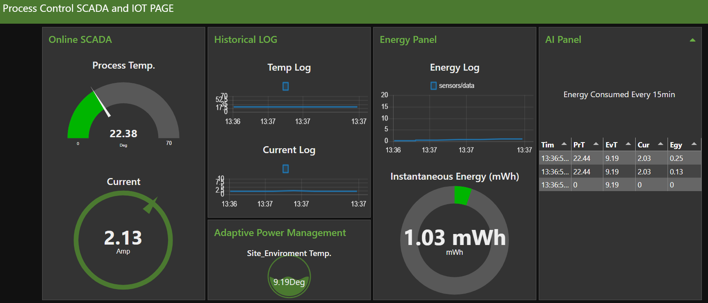
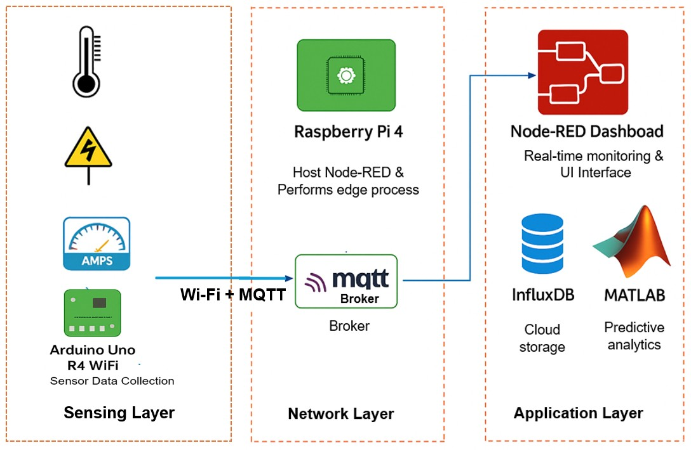
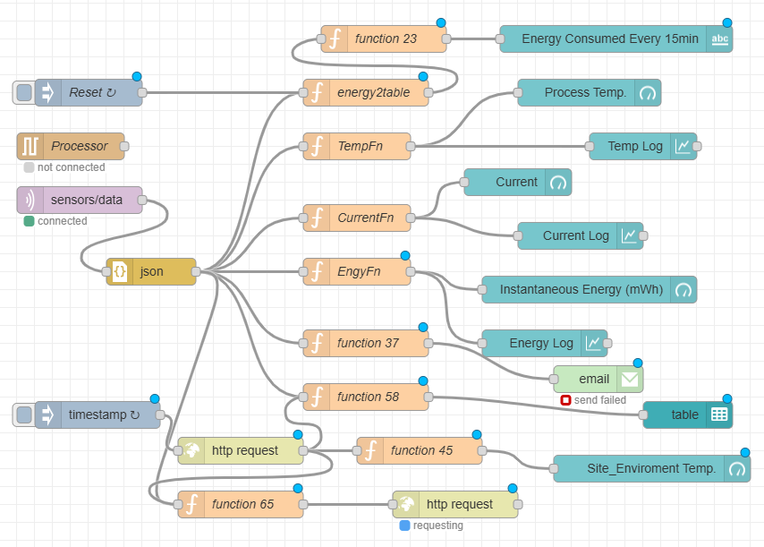

#  Industrial Automation System Design Using Open-Source IIoT SCADA with AI-Enhanced Predictive Analytics

This project demonstrates the design and implementation of an **open-source IIoT-based SCADA system** that integrates **edge computing**, **MQTT communication**, and **AI-driven predictive analytics** for intelligent energy management.  
The framework provides a **cost-effective, modular, and scalable** approach to modernising industrial control systems, enabling real-time monitoring, environmental data integration, and adaptive energy optimisation.

---

##  Key Features

- **Open-Source IIoT Architecture:** Built with Arduino Uno R4 Wi-Fi, Node-RED, InfluxDB, and MQTT.  
- **Edge Computing Integration:** Raspberry Pi handles local decision-making and real-time control.  
- **Predictive Analytics Engine:** Random Forest regression model forecasts energy consumption based on process and environmental temperatures.  
- **Interactive Web Interface:** Streamlit app for real-time energy prediction and user interaction.  
- **Secure Data Flow:** MQTT with authentication, Wi-Fi isolation, and static IP configuration.  
- **Scalable Design:** Easily adaptable for SMEs and multi-variable industrial processes.

---

##  System Architecture

The system follows a modular, three-layer architecture:

- **Sensing Layer:** Arduino Uno R4 Wi-Fi collects real-time process data (temperature, current) via DS18B20 and ACS712 sensors.  
- **Network Layer:** Data is streamed over MQTT to a Raspberry Pi edge node running Node-RED.  
- **Application Layer:** Node-RED handles flow logic, visualization, and anomaly detection; data is logged to InfluxDB and used for AI model training in Python.

---

##  Core Capabilities

- Real-time process/environment telemetry ingestion  
- Edge-based orchestration and local control  
- InfluxDB time-series data retention and visualization  
- Predictive analytics using Scikit-learn  
- Web-based interface via Streamlit for live inference  
- Lightweight and replicable for SMEs and research labs  

---

##  How It Works

1. **Data Collection:** Sensors send temperature and current data via MQTT to Raspberry Pi.  
2. **Processing:** Node-RED parses and logs data into InfluxDB.  
3. **AI Prediction:** Python model predicts energy use using Random Forest regression.  
4. **Visualization:** Streamlit app displays real-time energy prediction and process trends.  

---

##  Technology Stack

| Component | Description |
|------------|-------------|
| **Arduino Uno R4 Wi-Fi** | Sensor acquisition and edge control logic |
| **MQTT (PubSubClient)** | Lightweight message transmission |
| **Node-RED** | Logic orchestration and dashboard visualization |
| **InfluxDB** | Time-series data storage and analytics |
| **Python (Scikit-learn)** | Predictive energy model using Random Forest |
| **Streamlit** | Interactive web interface for real-time prediction |

---

##  Node-RED Flow

---

##  Model Development

The predictive model was developed using the **Scikit-learn** library in Python. Process and environmental temperature data were used as features to predict energy consumption.

### **Training Procedure**
1. The dataset was split into training and testing sets (80:20 ratio).  
2. A **Random Forest Regression** model was instantiated and trained on the training data.  
3. Model performance was validated using test data.

### **Training Code Example**

from sklearn.model_selection import train_test_split
from sklearn.ensemble import RandomForestRegressor
import joblib

#### Define features and target
X = df[['process_temperature', 'environmental_temperature']]
y = df['instantaneous_energy_consumption']

#### Train/test split
X_train, X_test, y_train, y_test = train_test_split(X, y, test_size=0.2, random_state=42)

#### Train model
model = RandomForestRegressor(n_estimators=100, random_state=42)
model.fit(X_train, y_train)

#### Save model
joblib.dump(model, 'energy_predictor_model.pkl')

## GUI Development Using Streamlit**

The Streamlit app enables users to input temperature values and obtain instant energy predictions through a lightweight web interface.

### Streamlit GUI Code

import streamlit as st
import joblib
import numpy as np

#### Load model
model = joblib.load('energy_predictor_model.pkl')

st.title('Energy Consumption Predictor')

pt = st.number_input('Enter Process Temperature')
et = st.number_input('Enter Environmental Temperature')

if st.button('Predict Energy Consumption'):
    prediction = model.predict(np.array([[pt, et]]))
    st.success(f'Predicted Energy Consumption: {prediction[0]:.2f}')

## Model Performance

| Metric                             | Value                               |
| ---------------------------------- | ----------------------------------- |
| **Mean Absolute Error (MAE)**      | 0.0042                              |
| **Root Mean Squared Error (RMSE)** | 0.0068                              |
| **Dataset Size**                   | 704 records                         |
| **Inputs**                         | Process & Environmental Temperature |
| **Output**                         | Energy Consumption (kWh)            |

## Repository Structure

├── /arduino_code/           # Arduino sketch for data acquisition

├── /node_red_flows/         # Node-RED flow JSON files

├── /python_model/           # Scikit-learn Random Forest model

├── /streamlit_app/          # Web interface files

├── /data/                   # Sample dataset (CSV format)

├── energy_predictor.joblib  # Trained model file

└── README.md                # Project documentation

##  How to Deploy

1. Flash Arduino with the provided `.ino` code.
2. Install Node-RED on Raspberry Pi and import the provided flow.
3. Set up InfluxDB bucket and API token.
4. Configure the OpenWeatherMap API key in the flow.
5. Run the system and access the live dashboard via `http://<raspberry_pi_ip>:1880/ui`.

## Conclusion
This project demonstrates the feasibility of predictive maintenance and energy optimization using open-source technologies.
It provides a practical pathway for engineers and researchers to integrate AI into industrial processes, enabling smarter, data-driven, and energy-efficient operations..

## Author
Adewale Ogabi

AI & Cloud Automation Engineer | Teesside University

Email Me hello@adewaleogabi.info

https://www.linkedin.com/in/ogabiadewale

