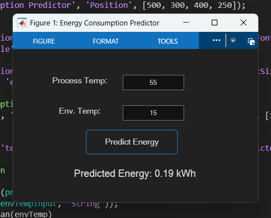

# Smart Industrial Process Monitoring System Using Open-Source Solutions

This project implements a scalable, real-time, IIoT-enabled SCADA system designed for intelligent process monitoring and predictive energy management. Leveraging open-source platforms such as **Arduino Uno R4 WiFi**, **Node-RED**, **InfluxDB**, and **MATLAB**, this system exemplifies the integration of edge computing, cloud-based data storage, and AI-driven predictive analytics.

## 🔧 System Architecture

The solution follows a modular, three-layer architecture (System.jpg):
- **Sensing Layer:** Arduino Uno R4 WiFi collects real-time process data (temperature, current) via DS18B20 and ACS712 sensors.
- **Network Layer:** Data is streamed over MQTT to a Raspberry Pi edge node running Node-RED.
- **Application Layer:** Node-RED handles flow logic, visualization, and anomaly detection; data is logged to InfluxDB and used for AI model training in MATLAB.

## 🧩 Project Structure

- 🔁 **Real-Time Data Acquisition** from industrial sensors
- 📊 **Live SCADA Dashboards** (Node-RED UI + historical charting)
- ☁️ **Time-Series Logging** using InfluxDB
- 🔮 **AI-Driven Predictive Analytics** via MATLAB regression models
- 🌡️ **Environmental Integration** using OpenWeatherMap API
- ⚠️ **Email Alerts** on process anomalies
- 🧠 **Energy Forecasting** for adaptive load management

## 🚀 How to Deploy

1. Flash Arduino with provided `.ino` code.
2. Install Node-RED on Raspberry Pi and import the provided flow.
3. Set up InfluxDB bucket and API token.
4. Configure the OpenWeatherMap API key in the flow.
5. Run the system and access the live dashboard via `http://<raspberry_pi_ip>:1880/ui`.

## 📷 Resources

## 🧠 AI Model: Energy Forecasting

A MATLAB regression model (`energy_model.mat`) predicts energy consumption using:
- Process Temperature
- Environmental Temperature

> **Prediction Equation:**
> `EnergyCon = 0.2761 – 2.82e-5 * ProcTemp – 0.00586 * EnvTemp`

## 🛡️ Security Features

- MQTT with username/password authentication
- Network isolation and MAC filtering
- Token-based InfluxDB authentication
- Email-based anomaly alerts with time-based throttling

## 📚 References

Attached Later.

## 🤝 Acknowledgements

Adewale F. Ogabi developed this work at Teesside University under the School of Computing, Engineering and Information Sciences.

## 📜 License

Available soon.
